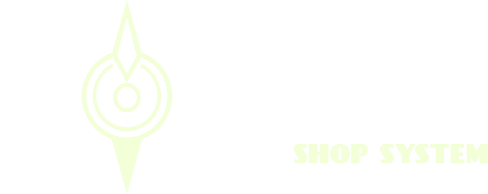

# Nozomi • Simple sell shop plugin 💰

<div align="center">
    
</div>
<br />
<div align="center">
    
    
    
    
</div>

---

**Nozomi is a simple and lightweight plugin that brings an item sell shop system to your Spigot Minecraft server.
It is very easy to configure and ready to use right off the bat.**

Players interact with a shop (which refreshes daily by default) to sell their items and receive rewards in turn (command
executions, items, money...).

<div align="center">
    
</div>

## 🟢 Features

- User-friendly shop interface, **no commands required** (except for the one to open it, of course)!
- Custom layouts (choose in which slots the items should appear in the shop).
- Pagination support.
- Highly customizable (each item in the shop can look completely different from the others).
- Different [types of rewards](#-rewards) built-in!
- Limit shop uses per player or group (or leave it as unlimited if you prefer).
- **Items in the shop auto-refresh** at midnight (can be changed to any time of the day / week or even be completely
  disabled).
- Lightweight (the ```.jar``` archive occupies around 1 MB of space!).

## 🟢 Installation

### Prerequisites

- A 1.21.x (or higher) [Spigot](https://getbukkit.org/) Minecraft server (version depends on the plugin release build);
    - **Note:** this plugin hasn't been tested on servers running on Spigot forks like Paper!
- (Optional) [Vault](https://www.spigotmc.org/resources/vault.34315/) (if you want to enable money rewards).

### Steps

To install Nozomi on your own Minecraft server, please follow these steps:

1) Go to the [Releases](https://github.com/Lexi115/project-nozomi/releases) section of this repository and download the
   latest build (or an older one depending on your
   server's Minecraft version).
2) Drag the ```nozomi.jar``` file into the ```plugins``` subdirectory inside your server's folder.
3) (Optional) Download Vault (link above) and place its ```Vault.jar``` file in the same directory as ```nozomi.jar```.
4) Run your server. Everything should already work as intended. If not, check whether the plugin is compatible with your
   Minecraft version.

## 🟢 Usage

Every Nozomi command starts with the ```/noz``` prefix.

### Main commands

- ```/noz shop [page]```: opens the shop GUI at the specified page.
    - **Arguments:**
        - ```page```: (Optional) the page number, defaults to 1.
    - **Permission:** ```nozomi.shop```
- ```/noz uses [player]```: prints the remaining shop uses for a certain player.
    - **Arguments:**
        - ```player```: (Optional) the player name, defaults to whoever ran the command.
    - **Permissions:**
        - ```nozomi.uses```: lets you see your own uses.
        - ```nozomi.uses.others```: lets you see other players' uses (requires ```nozomi.uses``` as well).
        - ```nozomi.uses.max.<amount>```: sets the max amount of shop uses each daily refresh for a player / group.
            - **Arguments:**
                - ```amount```: the amount of uses.
            - **Example:** ```nozomi.uses.max.10``` sets 10 max shop uses after a shop refresh.
        - ```nozomi.uses.max.unlimited```: bypasses any shop use limit (overrides ```nozomi.uses.max.<amount>```).
- ```/noz refresh```: manually refreshes the daily items in the shop.
    - **Permission:** ```nozomi.refresh```
- ```/noz reload```: reloads the plugin and its configs.
    - **Permission:** ```nozomi.reload```

### Other commands

- ```/noz help [page]```: opens the help manual at the specified page.
    - **Arguments:**
        - ```page```: (Optional) the page number, defaults to 1.
    - **Permission:** ```nozomi.help```
- ```/noz info```: prints information about the plugin.
    - **Permission:** ```nozomi.info```

## 🟢 Rewards

When a player successfully sells an item in the shop, he can receive several types of rewards (configured in the
```shop.yml``` file) depending on the item:

- **Console command:** executes a console command.
    - **Syntax:** ```cmd:<command>```
    - **Example:** ```cmd:tell %player% Thank you!``` whispers 'Thank you!' to the player.
- **Player command:** forces the player to execute a command (don't forget the slash '/').
    - **Syntax:** ```cmd:/<command>```
    - **Example:** ```cmd:/say I love fish``` makes that player say 'I love fish' in chat.
- **Item:** gives an item to the player.
    - **Syntax:** ```item:<material>:<amount>```
    - **Example:** ```item:iron_ingot:5``` gives 5 iron ingots to the player.
- **Money:** gives money to the player.
    - **Syntax:** ```money:<amount>```
    - **Example:** ```money:7.50``` deposits $7.50 into the player's account.
    - **Requires:** Vault

## 🟢 Contributing

Pull requests are welcome. If it's a major change to the code itself, please open an issue first to discuss it.

## 🟢 License

[MIT](https://choosealicense.com/licenses/mit/)
